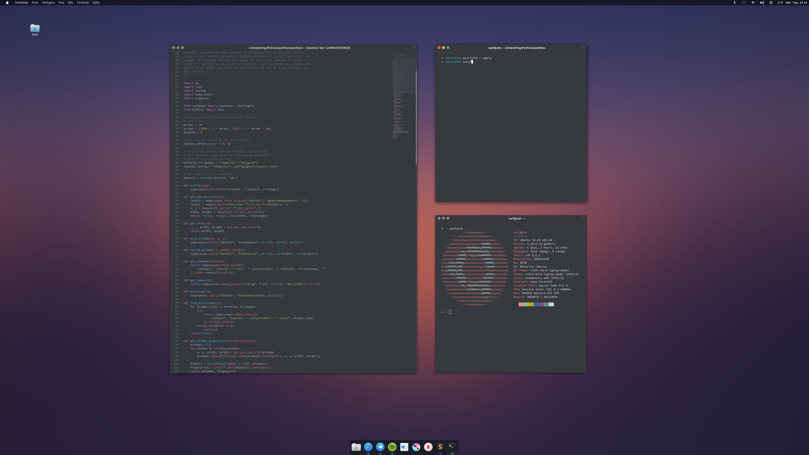
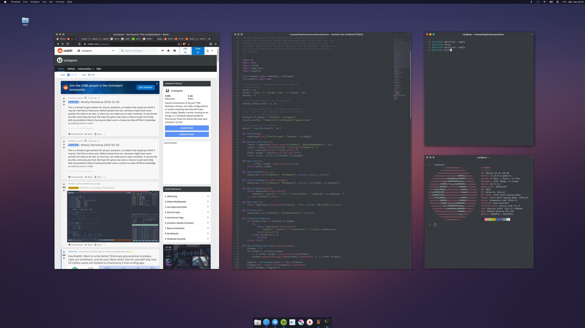
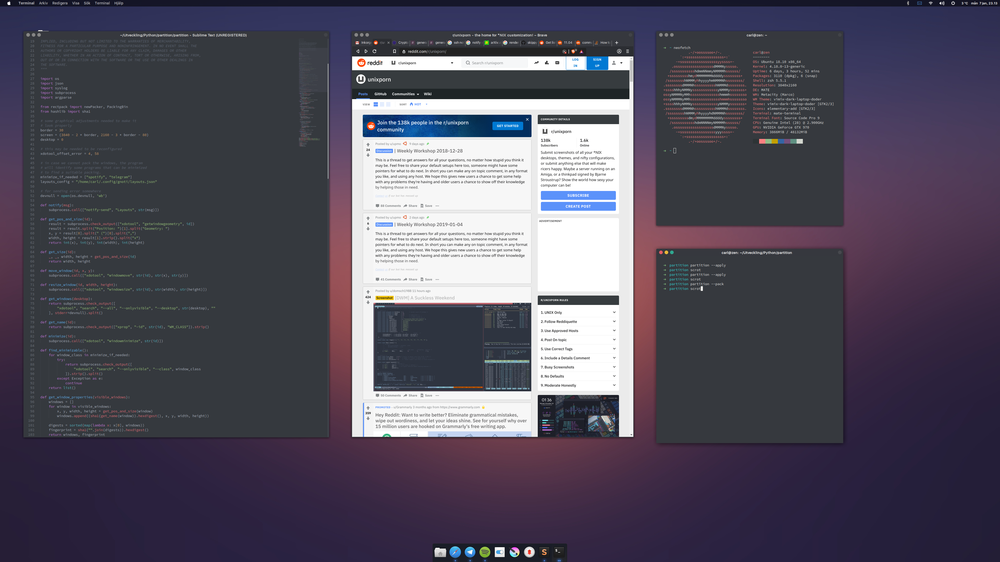

# gpartition

Below is an example of a layout. 
The user runs 

```
partition --apply
```

Seemingly, `partition` identifies the set of windows with one Sublime Text and two terminals. This means that the exact same layout has been learned before. The user can let `partition` re-learn the layout by invoking

```
partition --learn
```

If you are struggling with getting the windows to line up, simply invoke

```
partition --quantize
```

which will snap the windows to a much sparser grid on the desktop.



Here is another layout, consisting of a visible instance of Brace, one instance of Sublime Text and two terminals. This one has also been saved.



Now, the user ran

```
partition --pack
```

This takes the set of visible windows and packs them (with a gap) using a heuristic bin-packing algorithm. I did not bother to write my own, so the user needs to install it:

```
pip install rectpack
```


